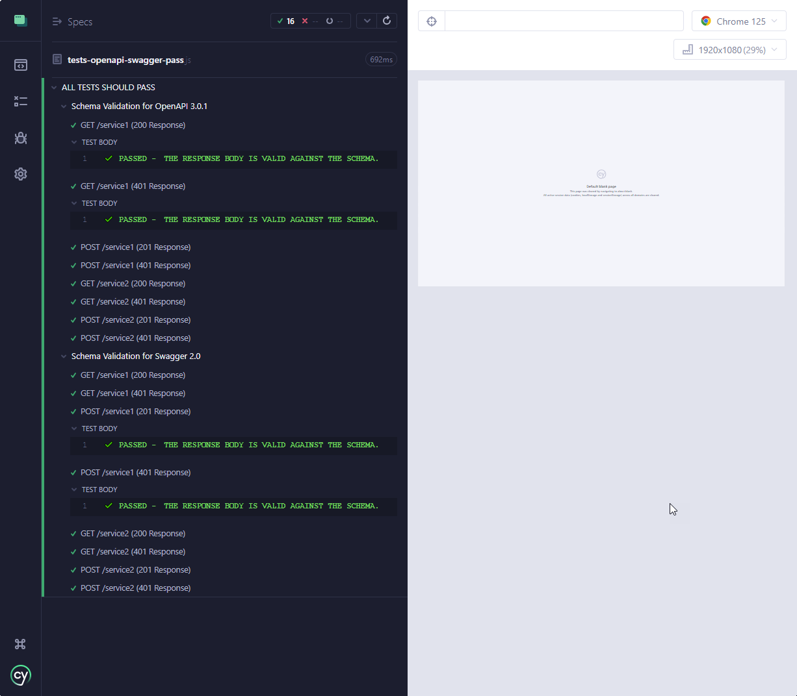
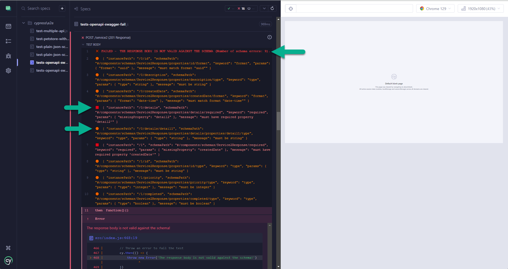
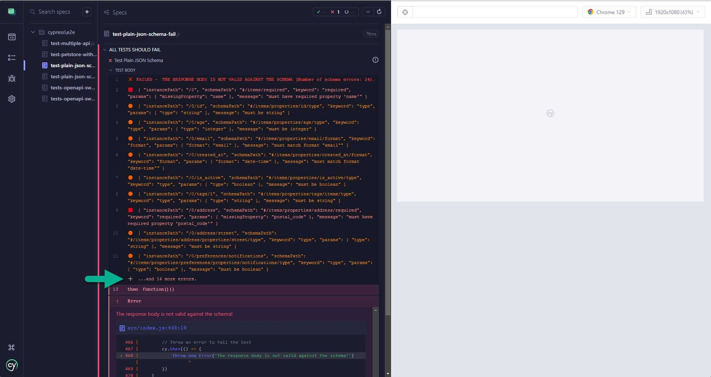
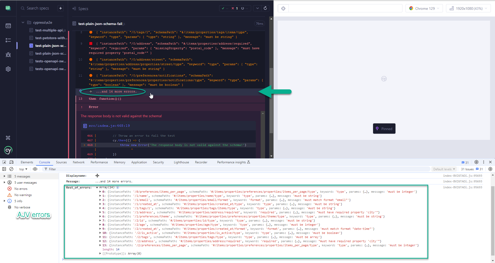

# cypress-ajv-schema-validator

A Cypress plugin for API testing to validate the API response against Plain JSON schemas, Swagger documents, or OpenAPI documents using Ajv JSON Schema validator.


## Main Features

- Cypress command `cy.validateSchema()` and utility function `validateSchema()` to report JSON Schema validation errors in the response obtained from any network request with `cy.request()`.
  
- The command `cy.validateSchema()` is chainable and returns the original API response yielded.
  
- Schema is provided as a JSON object, that could come from a Cypress fixture.
  
- Can validate schemas provided as a **plain JSON schema***, **OpenAPI 3.0.1 schema document** and **Swagger 2.0 schema document**.
  
- Provides in the Cypress log a summary of the schema errors as well as a list of the individual errors in the schema validation.
  
- By clicking on the validation summary line, it outputs in the console the number of schema errors, a full list of the schema errors as provided by Ajv, as well as a nested tree view of the validated data indicating exactly the errors and where they are happening in an easy-to-understand format.
  
- Ajv JSON Schema Validator was chosen as the core engine because of its versatility, powerful validation capabilities, and excellent documentation. For more information on Ajv, visit [Ajv official website](https://ajv.js.org/).

- The Ajv instance used in this plugin `cypress-ajv-schema-validator` is configured with the options `{ allErrors: true, strict: false }` to show all validation errors and disable strict mode.

&nbsp; 

> ⭐⭐⭐⭐⭐
> **Note:** This plugin complements **Filip Hric** [cypress-plugin-api](https://github.com/filiphric/cypress-plugin-api) and **Gleb Bahmutov** [@bahmutov/cy-api](https://github.com/bahmutov/cy-api) plugins to perform JSON schema validations.
>
> Example usage with these two API plugins:
> `cy.api('/users/1').validateSchema(schema);`
>
> To see an example of `cypress-ajv-schema-validator` working with the `cypress-plugin-api` plugin for the Swagger PetStore API, check the sample test [test-petstore-with-cypress-plugin-api.js](cypress/e2e/test-petstore-with-cypress-plugin-api.js).

&nbsp; 

## Installation

```sh
npm install cypress-ajv-schema-validator
// or
yarn add cypress-ajv-schema-validator
```

## Compatibility

- Cypress 12.0.0 or higher
- Ajv 8.16.0 or higher
- ajv-formats 3.0.1 or higher


## Configuration

Add the following lines either to your `cypress/support/commands.js` to include the custom command and function globally, or directly in the test file that will host the schema validation tests:

#### For `cy.validateSchema()` Custom Command

```js
import 'cypress-ajv-schema-validator';
```

#### For `validateSchema()` Function

```js
import validateSchema from 'cypress-ajv-schema-validator';
```


## API Reference

### Custom Commands

#### `cy.validateSchema(schema, path)`

Validates the response body against the provided schema.

##### Parameters

- `schema` (object): The schema to validate against. Supported formats are plain JSON schema, Swagger, and OpenAPI documents.
- `path` (object, optional): The path object to the schema definition in a Swagger or OpenAPI document.
  - `endpoint` (string, optional): The endpoint path.
  - `method` (string, optional): The HTTP method. Defaults to 'GET'.
  - `status` (integer, optional): The response status code. Defaults to 200.

##### Returns

- `Cypress.Chainable`: The response object wrapped in a Cypress.Chainable.

##### Throws

- `Error`: If any of the required parameters are missing or if the schema or schema definition is not found.

Example providing a Plain JSON schema:

```js
cy.request('GET', 'https://awesome.api.com/users/1')
  .validateSchema(schema);
```

Example providing an OpenAPI 3.0.1 or Swagger 2.0 schema documents:

```js
cy.request('GET', 'https://awesome.api.com/users/1')
  .validateSchema(schema, { endpoint: '/users/{id}', method: 'GET', status: 200 });
```

### Functions

#### `validateSchema(data, schema, path)`

Validates the given data against the provided schema.

##### Parameters

- `data` (any): The data to be validated.
- `schema` (object): The schema to validate against.
- `path` (object, optional): The path object to the schema definition in a Swagger or OpenAPI document.
  - `endpoint` (string, optional): The endpoint path.
  - `method` (string, optional): The HTTP method. Defaults to 'GET'.
  - `status` (integer, optional): The response status code. Defaults to 200.

##### Returns

- `Array`: An array of validation errors, or null if the data is valid against the schema.

##### Throws

- `Error`: If any of the required parameters are missing or if the schema or schema definition is not found.

Example providing a Plain JSON schema:

```js
cy.request('GET', 'https://awesome.api.com/users/1').then(response => {
  const data = response.body
  const errors = validateSchema(data, schema);
  expect(errors).to.have.length(0); // Assertion to ensure no validation errors
});
```

Example providing an OpenAPI 3.0.1 or Swagger 2.0 schema documents:

```js
cy.request('GET', 'https://awesome.api.com/users/1').then(response => {
  const data = response.body
  const errors = validateSchema(data, schema, { endpoint: '/users/{id}', method: 'GET', status: 200 });
  expect(errors).to.have.length(0); // Assertion to ensure no validation errors
});
```


## About APIs, Schemas, and Schema Documents

### Schema

When you make a request to an API endpoint with a specific method (GET, POST, etc.), it triggers an action/operation in the backend and generates a response (affirmative or negative regarding the action). However, in every case, the response data will follow a specific structure previously defined, called the API Schema.

An API schema is a metadata tool that defines how data is structured for an API. It represents the pact agreed upon by both the provider and the consumer.

#### JSON Schema

JSON Schema is a hierarchical, declarative language that describes and validates JSON data.

JSON schemas can be used to validate the possible responses obtained from calls to an API endpoint with a method (GET, POST, etc.). A call to a specific API endpoint might generate different types of responses (e.g., ok, unauthorized, forbidden, etc.), so each of these responses will have an associated JSON schema.

Example of a JSON schema:

```json
{
  "type": "object",
  "properties": {
    "name": { "type": "string" },
    "age": { "type": "number" }
  },
  "required": ["name", "age"]
}
```

### API Schema Document

An API schema document, or metadata document, allows you to describe your entire API. An API may include multiple endpoints, so the schema document will contain multiple schemas, one for each supported combination of Endpoint-Method-ResponseStatus.

#### OpenAPI 3.0.1 and Swagger 2.0 Schema Documents

The OpenAPI Specification (formerly Swagger Specification) is an API description format for REST APIs. One of the supported formats for these specifications is JSON. Swagger 2.0 is simply an older version of the OpenAPI 3.0.1 specification.

Example of an OpenAPI specification:

```json
{
  "openapi": "3.0.1",
  "info": {
    "title": "Sample API",
    "description": "API description in OpenAPI 3.0.1",
    "version": "1.0.0"
  },
  "paths": {
    "/users/{userId}": {
      "get": {
        "summary": "Get user by userId",
        "responses": {
          "200": {
            "description": "User found",
            "content": {
              "application/json": {
                "schema": {
                  "type": "object",
                  "properties": {
                    "id": { "type": "integer" },
                    "name": { "type": "string" }
                  }
                }
              }
            }
          },
          "401": {
            "description": "Unauthorized",
            "content": {
              "application/json": {
                "schema": {
                  "type": "object",
                  "properties": {
                    "code": { "type": "integer" },
                    "message": { "type": "string" }
                  }
                }
              }
            }
          }
        }
      }
    }
  }
}```


## Usage Examples

For detailed usage examples, check the document [USAGE-EXAMPLES.md](USAGE-EXAMPLES.md).

The examples included are for using:

- `cy.validateSchema()` command with a **Plain JSON schema**.
  
- `cy.validateSchema()` command with an **OpenAPI 3.0.1 schema** document.
  
- `cy.validateSchema()` command with a **Swagger 2.0 schema** document.

- `validateSchema()` function with an **OpenAPI 3.0.1 schema** document.
  
- `cy.validateSchema()` command in conjunction with **`cy.api()` from the `cypress-plugin-api` or `@bahmutov/cy-api` plugins**.


## Validation Results

Here are some screenshots of schema validation tests run in Cypress.

### Test Passed

When a test passes, the Cypress log will show the message: "✔️ **PASSED - THE RESPONSE BODY IS VALID AGAINST THE SCHEMA.**".



### Test Failed

When a test fails, the Cypress log will show the message: "❌ **FAILED - THE RESPONSE BODY IS NOT VALID AGAINST THE SCHEMA**"; indicating the total number of errors: _(Number of schema errors: N_).

Also, the Cypress log will show an entry for each of the individual schema validation errors as provided by Ajv. The errors that correspond to missing fields in the data validated are marked with the symbol 🗑️, and the rest of the errors with the symbol 👉.



#### Detailed Error View in the Console

If you open the Console in the browser DevTools, and click on the summary line for the schema validation error in the Cypress log, the console will display detailed information about all the errors. This includes:

- The total number of errors
- The full list of errors as provided by the AJV.
- A user-friendly view of the validated data, highlighting where each validation error occurred and the exact reason for the mismatch.


### Test Failed with More than 10 Errors

When there are more than 10 schema validation errors, the Cypress log will show only the first 10 and, at the end of the list, an additional line indicating "**...and _N_ more errors.**".



#### Detailed Error View in the Console

In this case, clicking on the summary line for the schema validation error in the Cypress log will also display: the total number of errors, the full list of errors as provided by AJV, and the user-friendly view of the schema mismatches, making it easy to understand where the errors occurred.


#### More Errors in the Console

When clicking on the "**...and N more errors.**" line in the Cypress log, the browser console will show additional details for the errors grouped under that entry as provided by Ajv.




## License

This project is licensed under the MIT License. See the [LICENSE](LICENSE) file for more details.


## Changelog

### [1.0.0]
- Initial release.
